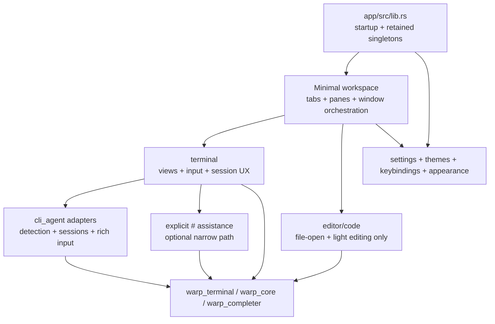
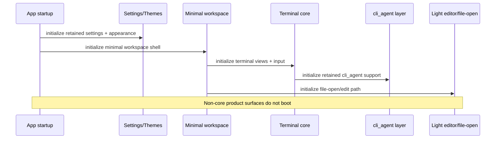
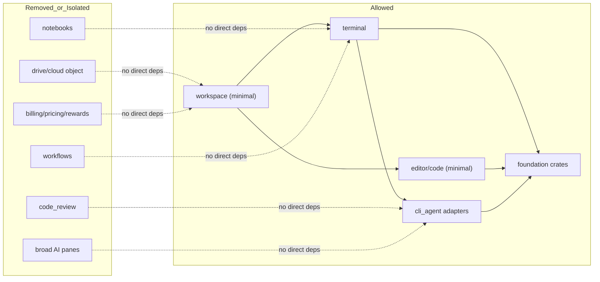
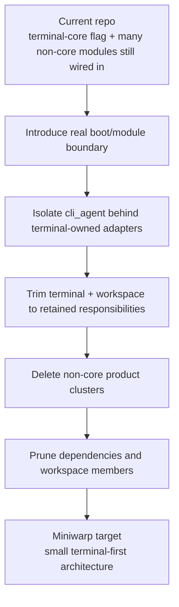

# Miniwarp Target Architecture

This document describes the intended stripped-down architecture for Miniwarp after the reduction work is complete.

## Design principles

- Terminal first: the app exists to run shells and manage terminal sessions.
- Keep only terminal-adjacent systems with direct user value.
- Prefer deletion over long-term hidden code paths.
- Keep `cli_agent` support, but isolate it from broad product modules.
- Minimize startup, dependency, and UI surface area.

## What remains

- app shell and startup
- minimal workspace/tab/pane orchestration
- terminal rendering and PTY/session management
- shell launch, history, completions, prompts, SSH flows that remain in scope
- themes, appearance, settings, keybindings
- lightweight editor/file-open support for terminal-adjacent workflows
- explicit `#`-triggered command assistance, if retained
- `cli_agent` detection, session tracking, rich input, and telemetry hooks
- foundational crates such as `warp_terminal`, `warp_core`, `warp_completer`, `warp_cli`, `warpui`, and related platform/runtime support

## What does not remain

- notebooks
- workflows as a standalone product surface
- code review panes and review-specific UI
- drive/cloud-object-first product flows
- shared-session/social/collaboration features
- pricing, billing, credits, rewards, referrals, resource-center upsell
- onboarding/product-tour flows that only support the broader Warp product
- persistent agent side panels and broad AI workspace surfaces

## Target module layering

## Boot sequence

## Dependency rule

Terminal-core code should not depend directly on deleted or deletable product clusters.

## Target responsibilities by area

### 1. App shell

- Own startup order.
- Register only retained singletons and views.
- Stop booting non-core product modules.

### 2. Minimal workspace

- Own windows, tabs, panes, basic tab management, essential modals, and retained menu/actions.
- Stop acting as a host for unrelated product surfaces.

### 3. Terminal core

- Own terminal rendering, PTY/session lifecycle, input, history, completion, prompt behavior, and terminal-specific settings.
- Export only the retained terminal surface.

### 4. CLI-agent layer

- Detect supported CLI agents.
- Track agent sessions and rich-input state.
- Depend only on terminal-core-owned adapter types.
- Avoid direct dependence on broad AI/chat/code-review/workflow modules.

### 5. Editor/file-open path

- Support opening and lightly editing files when launched from terminal workflows.
- Avoid growing back into a general product surface host.

### 6. Settings and themes

- Keep terminal-relevant appearance, keybinding, session, shell, and theme configuration.
- Remove settings for deleted products.

## Migration shape

## Source-of-truth mapping

- Product boundary: `specs/terminal-core-simplification/PRODUCT.md`
- Technical plan: `specs/terminal-core-simplification/TECH.md`
- Execution checklist: `PLAN.md`

When implementation changes, update these docs so they describe the architecture that actually ships.
